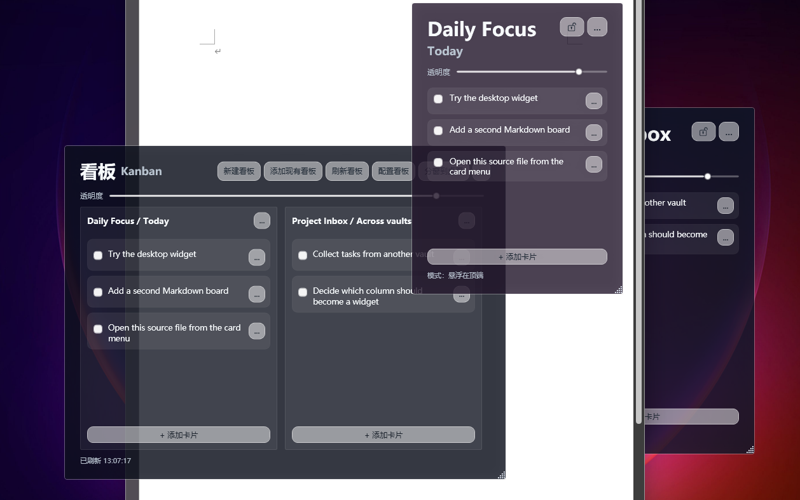

# Glass Kanban Overlay

English | [简体中文](README.zh-CN.md)

Keep selected Obsidian Kanban columns visible as transparent Windows desktop widgets.

Glass Kanban Overlay is a local-first WPF/.NET 8 app for Windows. You choose the Markdown board files and `##` columns you want to see; the app shows only those columns in a summary window or as separate desktop widgets.

It is not an Obsidian plugin. It does not scan the whole vault, use AI, sync to a cloud service, or send telemetry.

## Usage example



The summary window keeps selected columns together. **Split to desktop** opens the same boards as independent widgets. This screenshot uses the public-safe Markdown boards in [`examples/`](examples/).

## Real-world human-agent workflows

Glass Kanban Overlay can act as a shared view over plain Markdown: a person works with the board on Windows, while an authorized agent or another app updates the same file. The overlay itself does not run agents, connect to cloud storage, or schedule jobs.

### 1. Local agent and Obsidian

**Flow:** person ↔ local agent → Markdown board → Obsidian / Glass Kanban Overlay

A local agent can update an explicitly authorized `.md` board directly. If that file is inside an Obsidian vault with the Kanban plugin installed, the person can read and edit the same board in Obsidian. Glass Kanban Overlay detects local file changes and keeps the selected columns visible on the Windows desktop.

### 2. Cloud AI through a synced drive

**Flow:** person ↔ cloud AI app → cloud drive → Windows sync client → local Markdown → Glass Kanban Overlay

A cloud AI app with access to a drive can read or update a Markdown board there. The drive's sync client brings the changed file to Windows, where Glass Kanban Overlay reads the local copy and refreshes the board. Cloud access, credentials, and synchronization remain the responsibility of the external AI app and drive client.

### 3. Daily planning and periodic review

**Flow:** scheduled agent → daily TODO update → synced Windows board → weekly / monthly review

An external agent job can update a TODO board every day through either of the workflows above. The person sees the result on Windows and records progress by completing or moving cards. The agent can later read the Markdown completion state to prepare weekly and monthly reviews based on what was actually finished.

## Easiest installation: give the repository to a local agent

Send this one message to a trusted local coding agent on the Windows PC:

> Install Glass Kanban Overlay from https://github.com/beniedev/glass-kanban-overlay, launch it, and teach me the basic workflow. Follow the installing-agent instructions in the README.

This is an agent-assisted portable source build, not an installer or automatic updater.

<details>
<summary>Instructions for the installing agent</summary>

1. Confirm that the computer is Windows x64. Verify that the repository owner and Git remote are `beniedev`; stop if the source came from somewhere else.
2. Use `%LOCALAPPDATA%\Programs\GlassKanbanOverlay` as the default install folder unless the user gives another location.
3. If that folder already exists, do not merge or overwrite it. Preserve `Data\config.json` and ask the user before performing an upgrade.
4. Check for the .NET 8 SDK. If it is missing, explain why it is required and ask before installing it from an official Microsoft source.
5. Clone the repository into a working folder and run:

   ```powershell
   powershell -ExecutionPolicy Bypass -File .\scripts\New-PortableRelease.ps1
   ```

6. Copy the newly created `dist\GlassKanbanOverlay-win-x64-portable` directory to the install folder. Do not copy repository `Data` or `Log` content.
7. Create a desktop shortcut to `GlassKanbanOverlay.exe`, set its working directory to the install folder, and launch it once.
8. Do not scan a vault or add any Markdown file during installation. Ask the user to choose each board file explicitly.
9. After launch, explain how to create a board, add an existing `.md` board, select a column, split it to the desktop, open the source file, and find `Data\config.json` for local configuration.

</details>

## Project status

**Public source release — hands-on maintainer testing is complete.**

The source builds cleanly and its service-level regression suite passes. The maintainer has exercised board creation, adding and removing boards, card actions, summary and split widgets, settings, and the current toolbar/menu layout on a real Windows desktop. Neutral UI checks also cover missing-column recovery, external-edit conflicts, single-instance activation, and window recovery.

The GitHub workflow verifies the build and service-level tests. Desktop UI behavior, IME-specific behavior, and different monitor topologies remain environment-dependent manual compatibility checks. No binary release has been published; tagged binaries remain a separate release decision.

## What you can do

- Create a new Markdown board from a `TODO / DONE` or `TODO / DOING / DONE` template.
- Add an existing Markdown board and choose one of its `##` columns.
- View selected columns together in the summary window.
- Split selected columns into independent desktop widgets.
- Add, edit, complete, move to top, reorder, archive, or delete cards.
- Open the source Markdown file in the system default editor.
- Choose desktop, always-on-top, or normal window mode.
- Restore off-screen windows to the nearest usable display area.
- Keep drafts intact when an external file refresh arrives during editing.

Long board titles and widget notes wrap within the available header width. Action buttons remain in their own fixed column.

## Main actions

The summary toolbar uses these labels and this order:

1. **New board**
2. **Add existing**
3. **Refresh boards**
4. **Configure boards**
5. **Split to desktop**

Each board menu uses:

1. **Split to desktop**
2. **Open source Markdown file**
3. **Configure window**
4. **Remove board**

Removing a board from the app closes its split widget and clears its saved window state. It does not delete or rewrite the source Markdown file.

## Obsidian Kanban compatibility

The parser targets the Markdown subset used by the [Obsidian Kanban plugin](https://github.com/obsidian-community/obsidian-kanban):

- `##` headings are board columns.
- Checkbox tasks such as `- [ ] Write README` are cards.
- Frontmatter, ordinary paragraphs, block IDs, and Kanban settings blocks are preserved.
- Public-safe examples are available in [`examples/`](examples/).

A minimal supported settings block looks like this:

````markdown
%% kanban:settings
```
{"kanban-plugin":"board"}
```
%%
````

### Archive behavior

Archive is different from delete. Delete removes the card line. Archive moves the card out of the active column and into the Markdown archive section near the end of the file.

The app recognizes the standard `## Archive` heading. It also recognizes the literal Simplified Chinese heading `## 归档` when that heading follows the `***` archive separator.

````markdown
***

## Archive

- [ ] Archived card

%% kanban:settings
```
{"kanban-plugin":"board"}
```
%%
````

These Obsidian Kanban archive settings are preserved when present:

- `archive-with-date`
- `archive-date-format`
- `archive-date-separator`
- `append-archive-date`
- `max-archive-size`

## Safety boundary

Markdown writes are deliberately conservative:

- Only board files explicitly added in the app are read or written.
- Archive- or backup-like paths are blocked by default.
- Every write re-reads the source file first.
- A write is refused if the target column changed after the widget loaded it.
- Card edits also verify that the original task line is still where expected.
- Writes to one board are serialized across app instances and committed with an atomic same-directory replacement.
- Card text must remain on one line and cannot inject extra Markdown lines.
- Adding a card inserts one task line; other actions patch only the intended line, column, or archive area.

Missing columns are handled explicitly. You can choose another column, create the missing heading after confirmation, open the source file, or remove the board from the app.

## Interface languages

The maintained interface languages are:

- English
- 简体中文

**Auto / 跟随 Windows** uses Simplified Chinese for Chinese Windows locales and English for other locales. Legacy Traditional Chinese locale codes migrate to Simplified Chinese. Removed language values fall back to automatic selection instead of breaking configuration loading.

The README is maintained in the same two languages: this English file and [README.zh-CN.md](README.zh-CN.md).

## Manual source setup

Requirements:

- Windows
- .NET 8 SDK

Build and run the regression suite:

```powershell
dotnet build .\DesktopOverlayBoard.sln
dotnet run --project .\Tests\DesktopOverlayBoard.Tests.csproj
```

Launch from source or an existing local build:

```powershell
.\run-glass-kanban-overlay.ps1
```

Create a fresh self-contained win-x64 portable candidate:

```powershell
powershell -ExecutionPolicy Bypass -File .\scripts\New-PortableRelease.ps1
```

The packaging script refuses to overwrite an existing candidate. It builds and tests the app, publishes a self-contained executable, includes the license, notice, and both README languages, then creates a zip. It never packages local configuration or logs and does not replace the flat local dogfood executable.

## Local configuration

Runtime configuration is stored in:

```text
Data\config.json
```

This file is ignored because it contains machine-specific paths. Use [`Data/config.sample.json`](Data/config.sample.json) for public examples. Tests create temporary neutral board files and do not depend on a maintainer's vault.

## Limits

Glass Kanban Overlay does not currently provide:

- automatic whole-vault scanning;
- cross-column drag-and-drop or bulk selection;
- automatic archive sweeps;
- guaranteed support for every complex nested Obsidian Kanban card shape;
- an installer, automatic updater, Microsoft Store package, code signing, or a multi-architecture release matrix.

## Repository map

```text
glass-kanban-overlay\
  App.xaml                          shared glass styles
  MainWindow.xaml(.cs)              summary window, tray, split-widget orchestration
  SingleBoardWindow.xaml(.cs)       one board column as a desktop widget
  SettingsWindow.xaml(.cs)          board setup, language, and startup settings
  Services\MarkdownKanbanService.cs Markdown parsing and write-safety boundary
  Services\LocalizationService.cs   English and Simplified Chinese interface text
  Services\ConfigService.cs         configuration loading, saving, and migration
  Services\SingleInstanceService.cs one-instance mutex and activation signal
  Services\WindowPlacementService.cs window modes and display-area recovery
  Models\*.cs                       configuration and Kanban data models
  Tests\Program.cs                  service-level regression tests
  Data\config.sample.json           public sample configuration
  docs\assets\                     public-safe preview image
  scripts\New-PortableRelease.ps1  portable candidate builder
```

## Development notes

Read [AGENTS.md](AGENTS.md) before editing this repository. In particular:

- Do not broaden the app into a vault scanner.
- Do not add AI, cloud sync, telemetry, or background network behavior.
- Do not weaken conflict checks or silently swallow write failures.
- Verify code changes with the solution build and regression suite.
- Verify UI changes with a real Windows launch and screenshot.

## Reporting a problem

Include the Windows/.NET version, a neutral example board, and the exact action that failed. Do not attach `Data/config.json`, logs, private vault files, or credentials.
